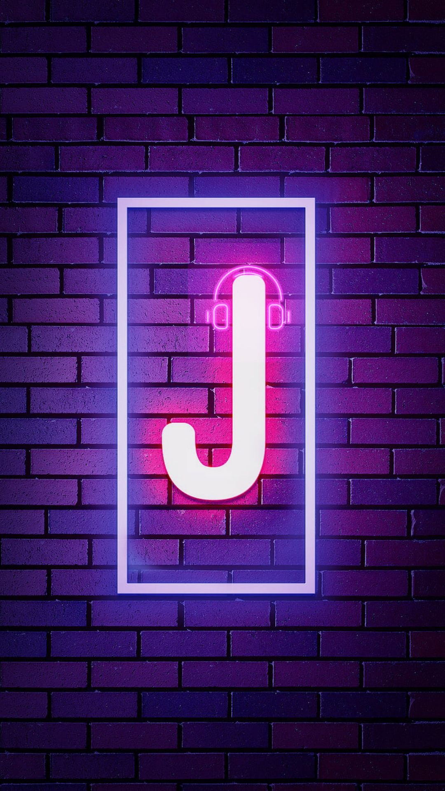

<h1> JamBot </h1>

A self-hosted Discord music bot. Aims to be a feature-compatible replacement for
recently taken-down bots like Rythm and Groovy.

https://www.npmjs.com/package/jambot

<br>
<br>

## Prerequisites

You need to have Node.js v14 LTS installed<sup> [1](#known-bugs)</sup>. You can download it from [here](https://nodejs.org/en/download/). In case you already have a different node version system-wide, you can install v14 for JamBot alone by running

```bash
npm i node@v14-lts
```

in your terminal.

Confirm that Node.js is installed by running

```bash
node -v
```

Certain tracks will need [ffmpeg](https://www.ffmpeg.org/) to be decoded. A lot of systems may already have this installed, but you will need to
[install it yourself](https://ffmpeg.org/download.html) if you do not have it.

## Installing

Once the [prerequisites](#prerequisites) are satisfied, run the following commands one after the
other in a terminal.

```bash
mkdir musicbot
cd musicbot
npm init -y
npm i jambot --only=prod
```

You can ignore these warnings


## Setting up the discord bot

[Create a discord bot user](docs/TOKEN.md), and then [add it to your server](docs/ADDING.md).

## Configuration

Follow the instructions at [CONFIG.md](docs/CONFIG.md).

## Usage

Once you've created the `config.json` file as detailed [here](docs/CONFIG.md), place a javascript file named `bot.js` in
the `musicbot` folder you created, with the following contents

```js
global.AbortController = require("node-abort-controller").AbortController;

require("jambot").init(require("config.json"));
```

That's it! Now run this file with the following command.

```
node bot.js
```

and confirm that the 'ready' message shows up in your terminal. If it does not show up, double check your [configuration](docs/CONFIG.md).

In a text channel, check the latency of the bot with `ping`, then join a voice channel and see all other available commands with `help`.
You can also see the commands [here](docs/COMMANDS.MD).

If you wish to, you can employ the same instance of the bot across multiple servers, or multiple instances of the bot on the same server - they won't interfere with each other. However, this will depend on your computer's resources, so you may want to enable performance logging in the [configuration](docs/CONFIG.md).

## Development

Clone this repo, and install all dependencies with

```
git clone https://github.com/porridgewithraisins/jam-bot
cd jam-bot
npm i
```

Build the typescript files with

```
npm run build
```

Test the various modules, and then start the bot so as to test it on an actual server

```
npm run test
```

## Updates

You can run `npm update` in a terminal opened to the `musicbot` folder you
created for the bot.

## Uninstall

There is no effect outside the `musicbot` folder you created for the bot. So
simply deleting the folder suffices.

## Known bugs

-   _Description_: There is a problem with the audio stream returned by ytdl on
    node.js v16. Relevant issue tracker :
    https://github.com/fent/node-ytdl-core/issues/902

    _Status_: Workaround implemented - Using node v14 even though discordjs
    complains. [AbortController](https://www.npmjs.com/package/node-abort-controller) is also required.

## Bugs/Feature requests

Submit an issue in this Github repo

## Changelog

-   _1.2.0_
    Added roles and permissions support. Added spotify support. Added better views (with a button-paginated view for queues). Included artist information in songs. Added support to play locally stored songs. Added bot messages !clean feature.

-   _1.1.6_
    When multiple instances of the bot are running in the same guild, bots only respond to commands sent by members it shares a voice channel with.
-   _1.1.5_
    Add better queue management and support ranges everywhere indexes are
    supported, such as in !search
-   _1.1.4_
    Fix youtube search issue.
